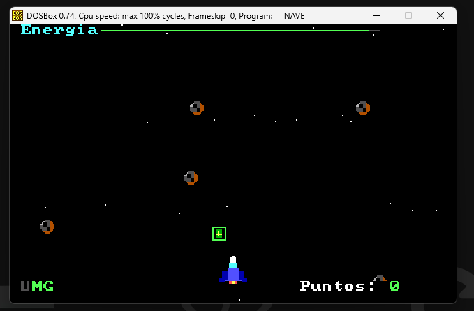

# SPACE RAID - Videojuego en Ensamblador 8086

SPACE RAID es un videojuego arcade inspirado en *River Raid*, desarrollado en ensamblador 8086 con TASM y pensado para ejecutarse en DOSBox. El proyecto combina renderizado directo sobre VGA Mode 13h, lectura de teclado via BIOS, logica de colisiones y efectos de sonido con PC Speaker.

## Caracteristicas

- Movimiento de nave con limites de pantalla
- Asteroides dinamicos con desplazamiento vertical y deriva lateral
- Sistema de disparos basado en pool reutilizable de balas
- Sistema de fuel con consumo progresivo y recarga por pickups
- Sistema UMG de vidas con estado de game over
- Puntuacion por destruccion de asteroides
- Sonidos por disparo, explosion, energia y perdida de vida
- Fondo espacial animado con efecto de desplazamiento

## Requisitos

- DOSBox
- TASM
- TLINK

## Compilacion

```bash
tasm nave.asm
tlink nave.obj
nave
```

## Controles

| Tecla   | Accion     |
| ------- | ---------- |
| Flechas | Movimiento |
| SPACE   | Disparar   |
| ESC     | Salir      |

## Tecnologias utilizadas

- Intel 8086
- Ensamblador x86 de 16 bits
- BIOS Interrupts
- VGA Mode 13h
- PC Speaker

## Arquitectura del juego

El juego sigue una estructura clasica de game loop. Tras inicializar `DS` y cambiar el modo de video con `INT 10h`, muestra un menu textual usando servicios BIOS y luego entra en un ciclo principal que ejecuta entrada, simulacion, colisiones, renderizado y sincronizacion vertical.

### Flujo principal

1. `handle_input` procesa teclado con `INT 16h`.
2. `update_game` actualiza balas, invulnerabilidad, explosion, asteroides, energia y fuel.
3. `check_collisions` resuelve impactos bala-asteroide, nave-asteroide y nave-energia.
4. `render_frame` reconstruye todo el frame en memoria VGA.
5. `wait_frame` sincroniza con el retrazo vertical leyendo el puerto `03DAh`.

### Renderizado

El motor usa acceso directo a memoria de video en el segmento `A000h`, propio del modo `13h` (320x200 con 256 colores). La rutina `put_pixel` calcula el offset lineal como `y * 320 + x`, optimizado con desplazamientos (`y * 256 + y * 64 + x`) para evitar multiplicaciones innecesarias.

Los sprites de la nave, asteroides y energia se almacenan como mapas de bytes indexados por color. Los valores `0` se consideran transparentes, por lo que las rutinas `draw_sprite_20` y `draw_sprite_10` solo escriben pixeles visibles.

### Colisiones

Las colisiones usan comparaciones de cajas alineadas al eje (AABB):

- Bala contra asteroide: se valida si el punto de la bala cae dentro del rectangulo del asteroide.
- Nave contra asteroide: se compara el rectangulo 20x20 de la nave contra cada asteroide 10x10.
- Nave contra energia: se verifica solapamiento con el pickup para restaurar `fuel`.

### Sistema de disparos

Las balas se manejan con un pool fijo de `MAX_BULLETS`. Cada slot tiene:

- bandera de actividad (`bullet_active`)
- posicion X (`bullet_x`)
- posicion Y (`bullet_y`)

Este enfoque evita asignacion dinamica y facilita la reutilizacion de slots al salir de pantalla o al impactar.

### Sistema de energia

El fuel desciende progresivamente mediante `consume_fuel`. Cuando llega a cero, se invoca `lose_life`. Los paquetes de energia aparecen periodicamente, descienden por la pantalla y al recogerse restauran el valor de `fuel` a `100`.

### Sistema UMG

La etiqueta `UMG` funciona como indicador visual de vidas. Cada letra se pinta en verde mientras la vida correspondiente siga disponible y en gris cuando ya fue perdida. Cuando `lives` llega a `0`, el juego activa `game_over`.

## Interrupciones BIOS y hardware usados

- `INT 10h`: cambio de modo de video, posicion de cursor e impresion de texto
- `INT 16h`: sondeo y lectura de teclado
- `INT 1Ah`: lectura del contador de ticks del BIOS
- `INT 21h`: retorno limpio a DOS
- Puerto `03DAh`: sincronizacion con retrazo vertical VGA
- Puertos `43h`, `42h`, `61h`: generacion de audio con PC Speaker

## Estructura del codigo

- `start`: bootstrap del programa
- `set_video`, `set_text`, `wait_frame`: control de video y temporizacion
- `handle_input`: entrada del jugador
- `update_*`: logica de simulacion
- `check_collisions` y derivados: resolucion de impactos
- `draw_*`, `put_pixel`, `print_*`: capa de render y HUD
- `tone`, `sound_*`: efectos de audio

## Capturas


